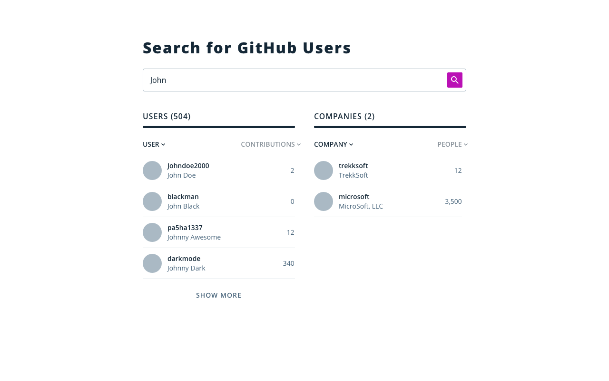
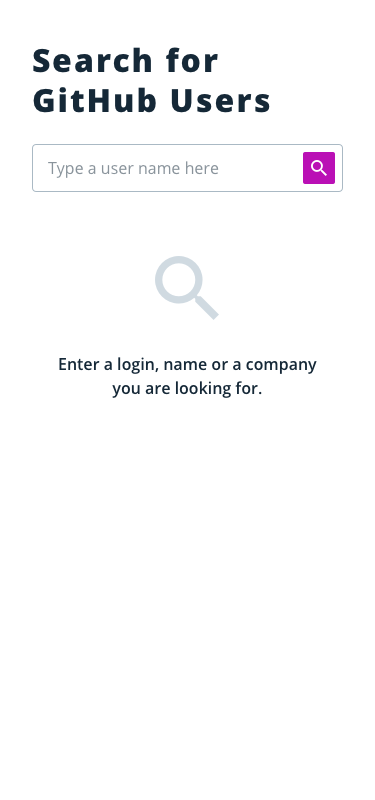
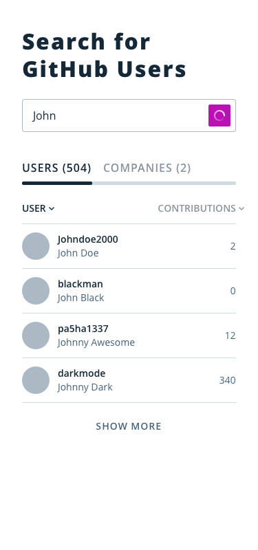
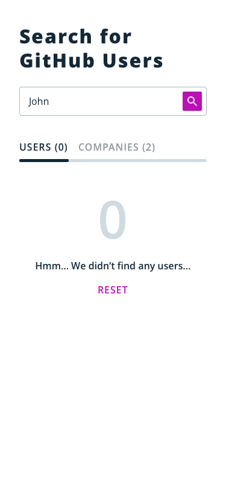
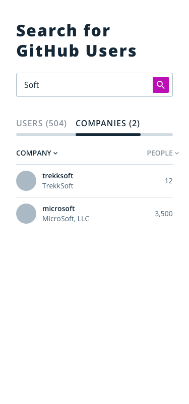

# Frontend Interview Challenge

## Learning Competencies
- Challenge understanding.
- Implement Frontend application using React/Redux, patterns and best practices.
- Implement tests.
- Manipulate Input/API parsing correctly.

## The challenge

Create a React application that retrieves and displays [user repositories and organisations in Github](https://docs.github.com/en/rest)

---

## INPUT
An input to enter the username

## OUTPUT
One area to display the repositories of the user and another area to display the organisations

---

## Good to have (don't need to be in the below specific order)
* Use ES6 syntax including arrow functions, destructuring and async/await
* Adding types with Flow or Typescript
* Adding a spinner when information is loading
* Deal with errors coming from the backend
* Some sort of Unit Test
* Some sort of Integration Test
* Having a nice UI using a components library (Bootstrap?)
* Divide the application in different pages and use a router
* Adding state management
* Show common tools used for you daily development environment (linters, code formatter, git workflow, docker and so on)
* Deploy the project somewhere

#Design
There are some designs for the project. All needed files can be found at [mockups folder](mockup)
## Desktop view

## Mobile views
Initial state              |  Users
:-------------------------:|:-------------------------:
      |  

Empty                      |  Companies
:-------------------------:|:-------------------------:
      |  
